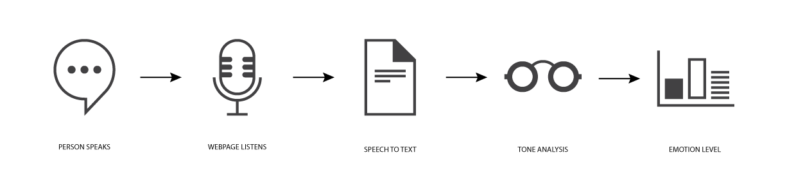
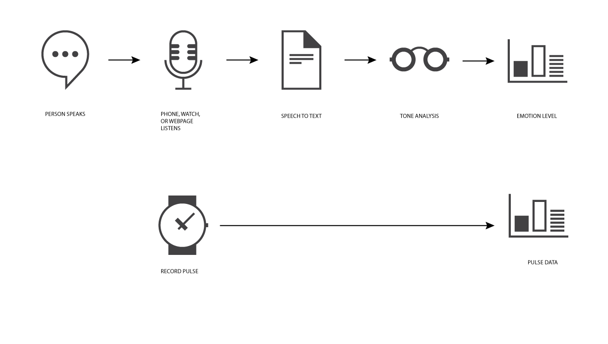
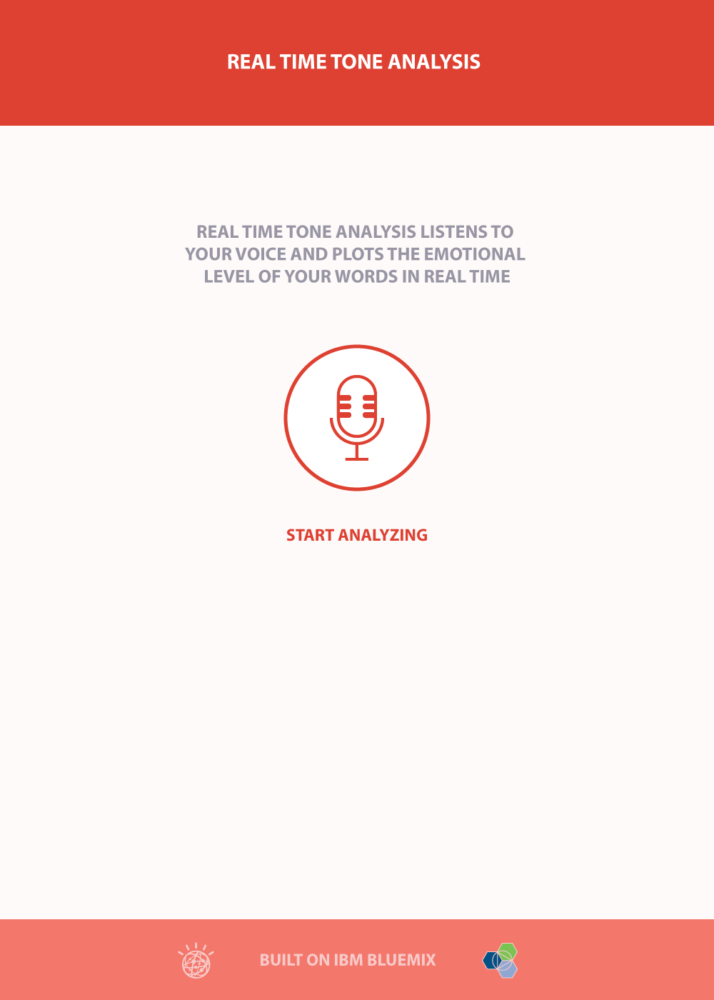
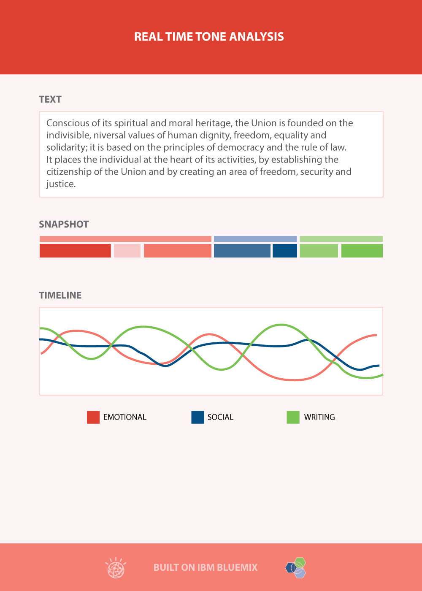

# real-time-tone-analysis

Real Time Tone Analysis samples dictation or conversations and displays a working timeline that plots the tone of the language spoken.

Here is a [working example](http://realtime-tone.mybluemix.net/)

The project is an experiment that combines watson [speech to text](https://speech-to-text-demo.mybluemix.net/), and [watson tone analysis](https://tone-analyzer-demo.mybluemix.net/) services, integrating them in a node.js backend running on IBM Bluemix.



There are many real world opportunities for combining these services. For example in call centres, offering instant feedback to operators, so that they can measure and control their response, or companies that run call centres to be concsious of repsonse levels over time.

The same combination of technology might be used personally to help an individual learn about their engagement and responses and manage it for themselves. This becomes especially interesting when tying the technology to other data sources, for example health data.



Health organizations, or insurance companies might encourage individuals to manage their emotions in connection with physical health - imagine being able to understand how an emotional conversation affects your pulse or blood pressure - and how health connected devices could feedback stimulus to help you be aware of that and manage it.

## Flow

The app opens with a simple scene - a button to begin analyzing dictation or conversation ...




Clicking the button leads to a simple dashboard that displays the spoken words, and periodically displays a snapshot of the current tone analyis, as well as a timeline of a running tone analyis ...




## Plan

This project is being developed as a half day workshop to train small groups of developers in Bluemix, Watson and Node technologies.

[Milestones](https://waffle.io/IBM-Bluemix/real-time-tone-analysis)

[Waffle Board](https://waffle.io/IBM-Bluemix/real-time-tone-analysis)


## Running the app on Bluemix

You can deploy your own instance of Real Time Tone Analysis to Bluemix. To do this, you can either use the _Deploy to Bluemix_ button for an automated deployment or follow the step below to create and deploy your app manually.
  
[](https://bluemix.net/deploy)  
**Note**: If deploying by this method, the app will fail on first deploy. After this initial failure, you must complete steps 7-8 below in order to successfully start your app.

1. Create a Bluemix Account

    [Sign up for Bluemix][bluemix_signup_url] or use an existing account.

2. Download and install the [Cloud Foundry CLI][cloud_foundry_url] tool

3. Clone the app to your local environment from your terminal using the following command:

  ```

  ```

4. `cd` into this newly created directory

5. Open the `manifest.yml` file and change the `host` value to something unique.

  The host you choose will determinate the subdomain of your application's URL:  `<host>.mybluemix.net`

6. Connect to Bluemix in the command line tool and follow the prompts to log in.

  ```
  $ cf api https://api.ng.bluemix.net
  $ cf login
  ```

8. Push it to Bluemix.

  ```
  $ cf push
  ```

And voila! You now have your very own instance of Capital Weather running on Bluemix.

## Run the app locally
1. Create a Bluemix Account. You will need this to create a Weather Channel service and grab the credentials later on.

    [Sign up][bluemix_signup_url] in Bluemix, or use an existing account.

2. If you have not already, [download node.js][download_node_url] and install it on your local machine.

3. Clone the app to your local environment from your terminal using the following command:

  ```
  git clone https://github.com/IBM-Bluemix/capital-weather.git
  ```

4. `cd` into this newly created directory

5. Install the required npm and bower packages using the following command

  ```
  npm install
  ```

6. Create a Weather Channel service using your Bluemix account and replace the corresponding credentials in your `vcap-local.json` file.

7. Start your app locally with the following command.

  ```
  npm run watch
  ```

This command will trigger [`cake`][cake_url] to build and start your application. When your app has started, your console will print that your `server started on: http://localhost:6003`.

Since we are using `cake`, the app is rebuilt continuously as changes are made to the local file system. Therefore, you do not have to constantly stop and restart your app as you develop locally. Run `npm run cake` to see the other commands available in the `Cakefile`.

## Decomposition Instructions
The primary purpose of this demo is to provide a sample implementation of the Weather Channel API. The relevant code for this integration is located within the `lib/weatherService.js` file and has been extracted into several [source gists][gist_url]. All helper functions are also included in the gists for reference. This section details the callback functions created to call this API.

### Current Conditions

A callback function for getting the current weather conditions for the input latitude/longitude value. Utilizes the `current` method of the Weather Channel API.

### Past Conditions

A callback function for getting the weather conditions on a prior date for the input latitude/longitude value. This function leverages the `getOneHC` helper method. Utilizes the `historical` method of the Weather Channel API.

### Historical Conditions

A callback function for getting weather conditions for the past ten years on the current date for the input latitude/longitude value. This function makes several calls to the `getOneHC` helper method. Utilizes the `historical` method of the Weather Channel API.

## API documentation
This sample application was built with developer reusability in mind. For ease of use, I have created [Swagger UI API documentation][swagger_api_url] for the algorithms built into this sample app. The API is currently rate limited, so please use it sparingly.

## Troubleshooting

The primary source of debugging information for your Bluemix app is the logs. To see them, run the following command using the Cloud Foundry CLI:

  ```
  $ cf logs capital-weather --recent
  ```
For more detailed information on troubleshooting your application, see the [Troubleshooting section](https://www.ng.bluemix.net/docs/troubleshoot/tr.html) in the Bluemix documentation.

## Contribute
We are more than happy to accept external contributions to this project, be it in the form of issues and pull requests. If you find a bug, please report it via the [Issues section][issues_url] or even better, fork the project and submit a pull request with your fix! Pull requests will be evaulated on an individual basis based on value add to the sample application.

### Credit
[3rdculturekid][3rdculturekid_url] - weather loading gif [[source]][weather_loading_gif_url]  
[designmodo][design_modo_url] - historical weather data icon [[source]][history_icon_url][[license]][creative_commons_url]  
[Lin Pham][linh_pham_url] - past and future weather data icons [[source]][past_future_icon_url]

## Privacy Notice
The capital-weather sample web application includes code to track deployments to Bluemix and other Cloud Foundry platforms. The following information is sent to a [Deployment Tracker](https://github.com/cloudant-labs/deployment-tracker) service on each deployment:

* Application Name (application_name)
* Space ID (space_id)
* Application Version (application_version)
* Application URIs (application_uris)

This data is collected from the VCAP_APPLICATION environment variable in IBM Bluemix and other Cloud Foundry platforms. This data is used by IBM to track metrics around deployments of sample applications to IBM Bluemix. Only deployments of sample applications that include code to ping the Deployment Tracker service will be tracked.

### Disabling Deployment Tracking

Deployment tracking can be disabled by removing `require("cf-deployment-tracker-client").track();` from the beginning of the `app.js` file.


[bluemix_signup_url]: https://ibm.biz/capital-weather-signup
[cloud_foundry_url]: https://github.com/cloudfoundry/cli
[download_node_url]: https://nodejs.org/download/
[issues_url]: https://github.com/IBM-Bluemix/eal-time-tone-analysis/issues
[creative_commons_url]: http://creativecommons.org/licenses/by/3.0/legalcode
