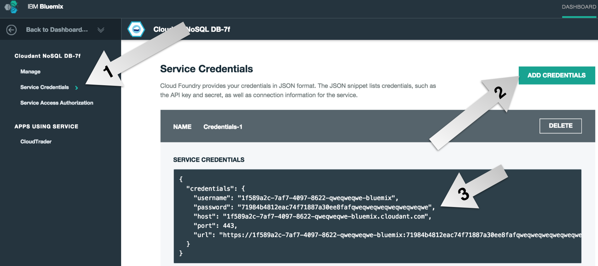

# Step 3: Creating a Database API

We have our base aplication working at this point. We have a Node.js back end running on Bluemix, a stylized front end which handles client-side interaction, and Watson SaaS to help us transcribe the user's speech. However we are missing a core component of any application: the datastore. We need to be able to persist dat. Right now, our transcripts are dissapearing into the ether after every session. This step will lay out how easy it is to not only create a database on Bluemix, but to interface with it by wrapping it in a simple RESTful [Loopback API][loopback_url].

## Creating the Loopback API

1. Run this command to install Strongloop

	```
	npm install -g strongloop
	```

2. Run this command to start the API creation wizard

	```
	slc loopback
	```

	* Name your application `myLoopbackAPI`
	* Name the directory that contains the project `myLoopbackAPI`

3. `cd` into the new `myLoopbackAPI` directory

4. For this workshop, we will be using a [Cloudant NoSQL database][cloudant_url]. Built on CouchDB, Cloudant makes it extremely simple to bootstrap a CRUD interface and is 100% accessible through a RESTful API. To set up our Loopback API to interface with Cloudant, we need to first install the proper module:

	```
	npm install loopback-connector-cloudant --save
	```
5. Run the following command to set up the API:

	```
	slc loopback:model
	? Enter the model name: Item
	? Select the data-source to attach Item to: db (memory)
	? Select model's base class (Use arrow keys) ❯ PersistedModel
	? Expose Item via the REST API? (Y/n) Y
	? Custom plural form (used to build REST URL): Items
	? Common model or server only? (Use arrow keys) common
	? Property name: name
	? Property type: (Use arrow keys) string
	? Required? y
	<enter> when done
	```

Your API is ready, but it's currently using an in-memory database. If you restart your application, all data will be lost! Let's fix that by using a Cloudant database from Bluemix. Cloudant is a NoSQL database.

## Creating the Cloudant Database

1. Update `server/datasources.json` to just:

	```
	{ }
	```

2. Create a [Cloudant database service][cloudant_service_url] from the Bluemix catalog
	* Choose the same space as your `realtime-tone` app
	* Choose to `Leave unbound` for now
	* Name the service `rtt-cloudant`
	* Name the credentials `rtt-cloudant-creds`
	* Select the `Shared` plan
	* Click Create

3. In the Cloudant service console, click on *Service Credentials* and generate credentials if they are not already present

	

4. Create the file `server/datasources.local.js` and add this code:

	```
	var http = require('http');
	var request = require('request');
	
	//Local Development
	//Enter your Cloudant URL here. Get this from your Bluemix Cloudant service by clicking on "Show Credentials" or "Service Credentials".
	var url = "PUT_URL_HERE";
	var databaseName = "mydb"; //You need to log into Cloudant Dashbaord and create this database
	
	//Running on Bluemix. Gets the Cloudant credentials from VCAP_SERVICES env variable
	if(process.env.VCAP_SERVICES){
		var vcap_services = JSON.parse(process.env.VCAP_SERVICES);
		url = vcap_services.cloudantNoSQLDB[0].credentials.url;
	}
	
	//Create the database (mydb) if it doesn't exist.
	request.put(url + "/" + databaseName).on('error', function(err) {
	    console.log("ERROR CREATING DATABSE: " + err);
	  })
	
	module.exports = {
	  "db": {
		  "connector": "cloudant",
		  "url": url,
		  "database": databaseName
		}
	};
	```
	Copy the `url` field from your Cloudant credentials to

	```
	var url = "PUT_URL_HERE";
	```

5. Next, install the `request` module

	```
	npm install request --save
	```

6. Start the server!

	```
	node .
	```

Your REST API is available at `http://0.0.0.0:3000/api/Items`  
Your API Explorer API at `http://0.0.0.0:3000/explorer`

## Push to Bluemix

1. We don't want to push the `node_modules` folder to Bluemix. So, lets create a `.cfignore` file

	```
	echo node_modules >> .cfignore
	```

2. Then, push the application to Bluemix, but don't start the app yet

	```
	cf push cloudantAPI-USERNAME --no-start
	```
	
	If we tried to start the app now, it would fail since it needs a bound Cloudant database.

3. Go to your new app's dashbaord and click on `Bind a Service`, choose the Cloudant database you created earlier. You'll be prompoted to restage. Click Yes. After that completes (about a minute):

Your REST API is available at `http://cloudantAPI-USERNAME.mybluemix.net/api/Items`  
Your API Explorer API at `http://cloudantAPI-USERNAME.mybluemix.net/explorer`

## Update your app for saving

Let's update our `realtime-tone` app now so that it leverages this new Cloudant DB API. When you click the `Save` button, we want it to call our Loopback API with the data we want to save.

1. Create a file called `save.js` which handles saving the Speech to Text results for the session.

2. Update the POST call in `save.js` to call your new API:

	```
	$.post( "http://cloudantAPI-USERNAME.mybluemix.net/api/Items", dataToSend,function( data ) {
	```

3. Test the app locally

4. Make a GET (go to it in your browser) to `http://cloudantAPI-USERNAME.mybluemix.net/api/Items` to ensure everything is working.

5. Push the updated realtime app back to Bluemix

Our transcripts are now being saved to the database. Easy enough, right? This pattern is extremely useful when building applications where encapsulation and reusability are priorities. Let's discuss this in (a little) more depth.

## Microservices

Talk about why use this architecture, blah blah blah.

<!--Links-->
[cloudant_url]: https://cloudant.com/
[loopback_url]: http://loopback.io/
[cloudant_service_url]: https://console.ng.bluemix.net/catalog/services/cloudant-nosql-db/
